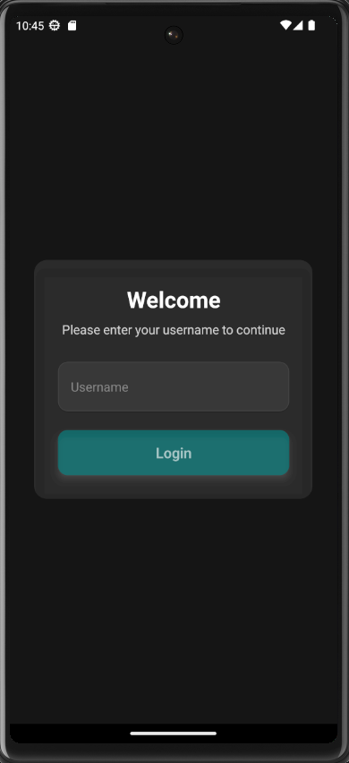
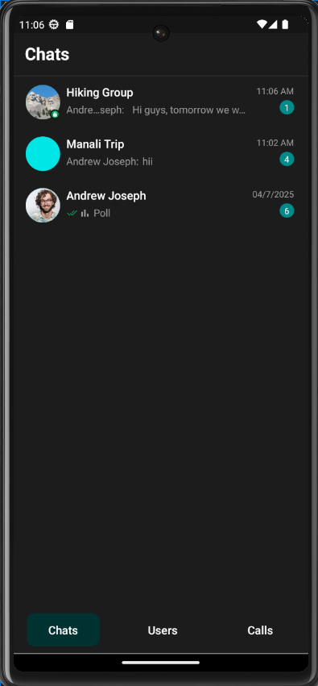
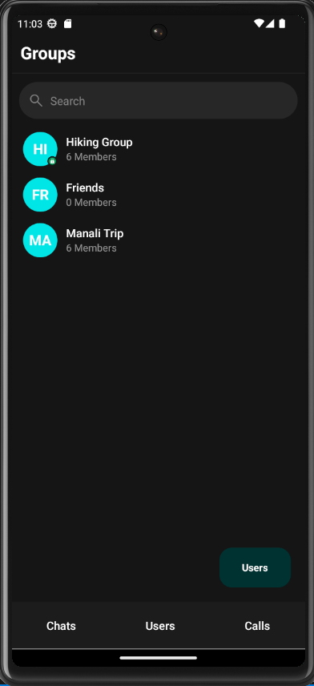
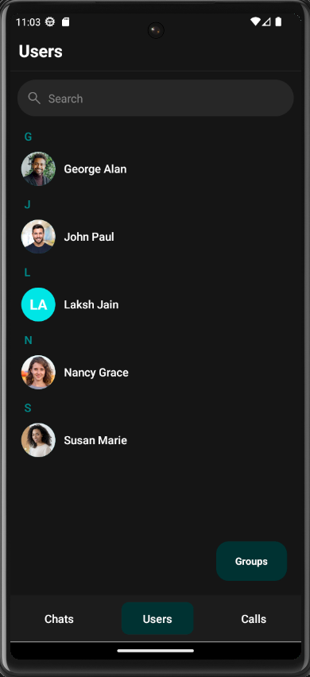
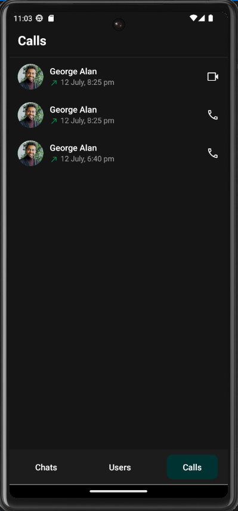
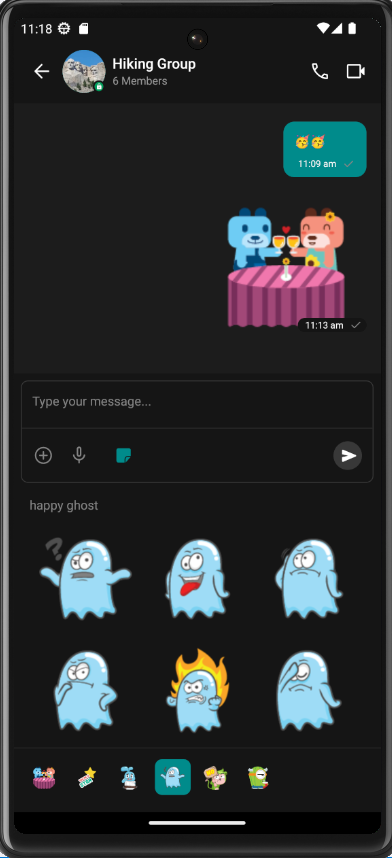
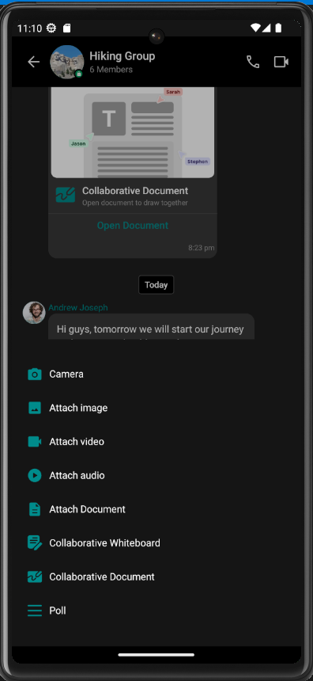
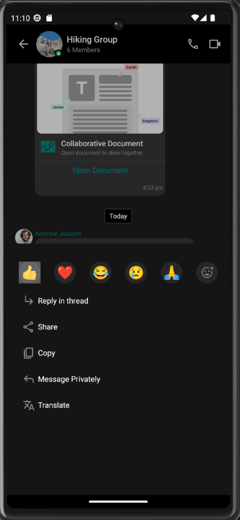
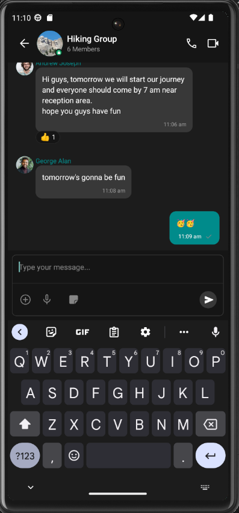

# 📱 React Native Chat App with CometChat

This is a cross-platform chat application built using **React Native** and **CometChat UI Kit**. It features user-to-user messaging, group chats, call logs, and real-time incoming call handling. The UI is simple and clean, built with the help of CometChat’s powerful prebuilt components.

## 🚀 Features

- 🔐 **Authentication** using UID and Auth Key
- 💬 **One-on-One & Group Chat** support
- 📞 **Incoming Call Handling**
- 👥 **User and Group Directory**
- 📃 **Call Logs**
- 🧭 **Bottom Tab Navigation**
- ➕ **Floating Action Button** to switch between Users and Groups

---

## 🛠️ Technologies Used

- [React Native](https://reactnative.dev/)
- [CometChat UI Kit](https://www.cometchat.com/docs/sdk/react-native/overview)
- TypeScript

---

## 📦 Installation

### 1. Clone the repository

```bash
git clone https://github.com/your-username/cometchat-react-native-app.git
cd cometchat-react-native-app
```

### 2. Install dependencies
```bash
npm install
# or
yarn install
```

### 3. Install CometChat UIKit SDK
```bash
npm install @cometchat/chat-uikit-react-native @cometchat/chat-sdk-react-native
```

### 4. Set up native dependencies
For iOS:
```bash
cd ios && pod install && cd ..
```

### 🔧 Configuration
Update the APP_ID, AUTH_KEY, and REGION in Main.tsx:
```bash
const APP_ID = 'YOUR_COMETCHAT_APP_ID';
const AUTH_KEY = 'YOUR_AUTH_KEY';
const REGION = 'YOUR_REGION';
```

### ▶️ Running the App
Android
```bash
npx react-native run-android
```
iOS
```bash
npx react-native run-ios
```
### 🖼️ Screenshots

<table>
  <tr>
    <th>Login</th>
    <th>Chats</th>
    <th>Groups</th>
    <th>Calls</th>
    <th>users</th>
  </tr>
  <tr>
    <td></td>
    <td></td>
    <td></td>
    <td></td>
    <td></td>
  </tr>
  <tr>
    <th>Stickers</th>
    <th>Options</th>
    <th>Message Options</th>
    <th>Chat</th>
    <th>Polls & Collabration</th>
  </tr>
  <tr>
    <td></td>
    <td></td>
    <td></td>
    <td></td>
    <td></td>
  </tr>
</table>


### 🙋‍♂️ Author
Developed by **Laksh R Jain**  
📧 jainlaksh2006@gmail.com

### 📄 License
This project is licensed under the MIT [License](). See the LICENSE file for details.
